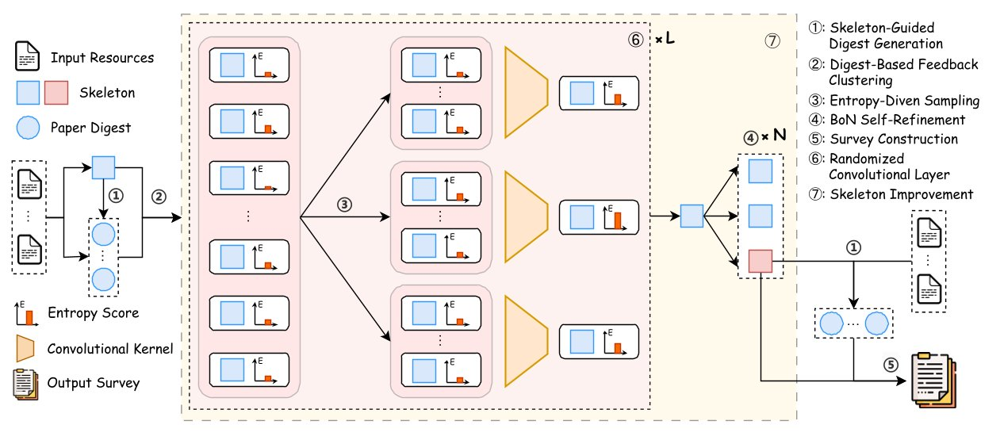

# $\text{LLM}\times\text{MapReduce}$: Simplified Long-Sequence Processing using Large Language Models

<p align="center">•
 <a href="#-introduction"> 📖Introduction </a> •
 <a href="#%EF%B8%8F-getting-started">⚡️Getting Started</a> 
 <a href="#-experiment-results">📊Experiment Results</a> •
 <a href="#-citation">📝 Citation</a>•
</p>
<p align="center">•
 <a href="https://arxiv.org/abs/2410.09342">📃V1 Paper</a>
 <a href="">📃V2 Paper</a>
 <a href="https://huggingface.co/datasets/R0k1e/SurveyEval">📚 SurveyEval</a> •

</p>
</div>

# 🎉 News
* 202503xx: Introducing the $\text{LLM}\times\text{MapReduce}\-V2$ framework to support long-to-long generation! Released [paper]() on arXiv. You could try to use it with expected topic and descriptions in discussions -> Write Ariticle.
* 20250221: Added support for both OpenAI API and OpenAI-compatible APIs (e.g., vLLM). 🚀
* 20241012: Released our [paper](https://arxiv.org/abs/2410.09342) on arXiv. 🎇
* 20240912: Introducing the $\text{LLM}\times\text{MapReduce}$ framework, which delivers strong performance on long-sequence benchmarks and is compatible with various open-source LLMs. 🎊

# 📖 Introduction
$\text{LLM}\times\text{MapReduce}-V1$ Readme could be seen [here](LLMxMapReduce_V1/README.md).

Long-form generation is crucial for a wide range of practical applications, typically categorized into short-to-long and long-to-long generation. While short-to-long generations have received considerable attention, generating long texts from extremely long resources remains relatively underexplored. The primary challenge in long-to-long generation lies in effectively integrating and analyzing relevant information from extensive inputs, which remains difficult for current large language models (LLMs). In this paper, we propose $\text{LLM}\times\text{MapReduce}\-V2$, a novel test-time scaling strategy designed to enhance the ability of LLMs to process extremely long inputs. Drawing inspiration from convolutional neural networks, which iteratively integrate local features into higher-level global representations, $\text{LLM}\times\text{MapReduce}\-V2$ utilizes stacked convolutional scaling layers to progressively expand the understanding of input materials. Both quantitative and qualitative experimental results demonstrate that our approach substantially enhances the ability of LLMs to process long inputs and generate coherent, informative long-form articles, outperforming several representative baselines.

<div align="center">
  
</div>

# ⚡️ Getting Started
# Getting Started
The following steps are about $\text{LLM}\times\text{MapReduce}\-V2$. If you want to use $\text{LLM}\times\text{MapReduce}-V1$, you need to refer to [here](LLMxMapReduce_V1/README.md).

To get started, ensure all dependencies listed in requirements.txt are installed. You can do this by running:
```bash
cd LLMxMapReduce_V2
conda create -n llm_mr_v2 python=3.11
conda activate llm_mr_v2
pip install -r requirements.txt
```
Before evaluation, you need to download punkt_tab firstly.
```python
import nltk
nltk.download('punkt_tab')
```
## Env config
Please set your OPENAI_API_KEY and OPENAI_API_BASE in your environment variables before start the pipeline. If you use miniconda, replace `anaconda3` in `LD_LIBRARY_PATH` with `miniconda3`
```bash
export LD_LIBRARY_PATH=${HOME}/anaconda3/envs/llm_mr_v2/lib/python3.11/site-packages/nvidia/nvjitlink/lib:${LD_LIBRARY_PATH}
export PYTHONPATH=$(pwd):${PYTHONPATH}
export OPENAI_API_KEY=Your OpenAI Key
export OPENAI_API_BASE=Your OpenAI base url
```
## Start LLMxMapReduce_V2 pipeline
Follow the instructions and generate a report. The generated Markdown file is at ./output/md. 
```bash
cd LLMxMapReduce_V2
bash scripts/pipeline_start.sh TOPIC output_file_path.jsonl
```
If you wish to use your own data, the input data should have following components at least:
```json
{
  "title": "The article title you wish to write",
  "papers": [
    "title": "The material title",
    "abstract": "the abstract material",
    "txt": "the reference material full content"
  ]
}
```

You could use to use [this script](LLMxMapReduce_V2/scripts/output_to_md.py) to convert data from `.jsonl` to multiple `.md` files.

# 📃 Evaluation
The following steps are about $\text{LLM}\times\text{MapReduce}\-V2$. If you want to use $\text{LLM}\times\text{MapReduce}-V1$, you need to refer to [here](LLMxMapReduce_V1/README.md).

Follow the steps below to set up the evaluation:
## 1. Download the Dataset
Before running the evaluation, you need to download the `test` split of [SurveyEval dataset](https://huggingface.co/datasets/R0k1e/SurveyEval). After downloading, store it in a `.jsonl` file.

## 2. Run the Evaluation
Execute the [scripts](LLMxMapReduce_V2/scripts/eval_all.sh) to evaluate the generated result. 
```bash
cd LLMxMapReduce_V2
bash scripts/eval_all.sh output_data_file_path.jsonl
```
Aware that the evaluation process is token-consuming, you need to make sure you have enough balance.

# 📊 Experiment Results
Our experiments demonstrate the improved performance of various LLMs using the $\text{LLM}\times\text{MapReduce}\-V2$ framework on SurveyEval. Detailed results are provided below.

| **Methods**           | **Struct.** | **Fait.** | **Rele.** | **Lang.** | **Crit.** | **Num.** | **Dens.** | **Prec.** | **Recall** |
|-----------------------|-------------|-----------|-----------|-----------|-----------|----------|-----------|-----------|------------|
| Vanilla               | 94.44       | 96.43     | **100.00**| **96.50** | 37.11     | 78.75    | **74.64** | 25.48     | 26.46      |
| + Skeleton            | **98.95**   | **97.03** | **100.00**| 95.95     | **41.01** | **135.15**| 72.96     | **62.60** | **65.11**  |
| AutoSurvey            | 86.00       | 93.10     | **100.00**| 92.90     | 68.39     | 423.35   | 31.97     | 50.12     | 51.73      |
| LLMxMapReduce_V2       | **95.00**   | **97.22** | **100.00**| **94.34** | **71.99** | **474.90**| **52.23** | **95.50** | **95.80**  |

# 📑ToDo
🔜 Support Autonomous Terminate

🔜 Open source Resource Collection Component


# 📝 Citation
If you have used the content of this repository, please cite the paper and leave your star :).

```
@misc{zhou2024llmtimesmapreducesimplifiedlongsequenceprocessing,
      title={LLM$\times$MapReduce: Simplified Long-Sequence Processing using Large Language Models}, 
      author={Zihan Zhou and Chong Li and Xinyi Chen and Shuo Wang and Yu Chao and Zhili Li and Haoyu Wang and Rongqiao An and Qi Shi and Zhixing Tan and Xu Han and Xiaodong Shi and Zhiyuan Liu and Maosong Sun},
      year={2024},
      eprint={2410.09342},
      archivePrefix={arXiv},
      primaryClass={cs.CL},
      url={https://arxiv.org/abs/2410.09342}, 
}
```


