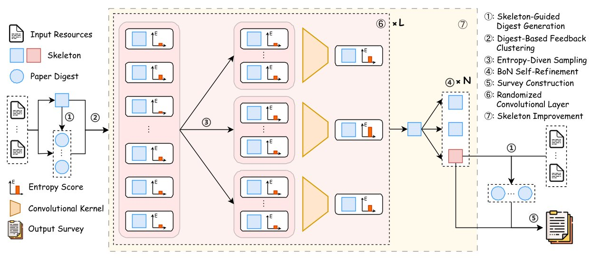

# $\text{LLM}\times\text{MapReduce}$: 使用大语言模型简化长序列处理

<a href='https://surveygo.modelbest.cn/'></a> <a href='https://arxiv.org/abs/2410.09342'></a> <a href='https://arxiv.org/abs/2504.05732'></a> <a href='https://huggingface.co/datasets/R0k1e/SurveyEval'></a> <a href='README.md'></a>

# 🎉 新闻
- [x] **`2025.04.22`** 发布 [SurveyGO](https://surveygo.modelbest.cn/)，一个由 LLMxMapReduce-V2 驱动的在线写作系统。
- [x] **`2025.04.09`** 在 [arXiv](https://arxiv.org/abs/2504.05732) 上发布 LLMxMapReduce-V2 论文。
- [x] **`2025.02.21`** 增加对 OpenAI API 和 OpenAI 兼容 API（如 vLLM）的支持。
- [x] **`2024.10.12`** 在 [arXiv](https://arxiv.org/abs/2410.09342) 上发布 LLMxMapReduce-V1 论文。
- [x] **`2024.09.12`** 发布 LLMxMapReduce-V1 代码。

# 📚 概述
**LLMxMapReduce** 是一个分治框架，旨在增强现代大语言模型（LLMs）在理解和生成长序列方面的能力。该框架由 **AI9STARS**、**OpenBMB** 和 **THUNLP** 合作开发，灵感来源于大数据领域的经典 MapReduce 算法。我们的目标是构建一个由 LLM 驱动的分布式计算系统，能够高效处理长序列。以下是 LLMxMapReduce 的主要版本：

* [**LLMxMapReduce-V1**](https://github.com/thunlp/LLMxMapReduce/blob/main/LLMxMapReduce_V1)：利用结构化信息协议和上下文置信度校准来增强长序列理解，使 [MiniCPM3-4B](https://github.com/OpenBMB/MiniCPM) 在长文本评估中的表现超过 70B 规模的模型。
* [**LLMxMapReduce-V2**](https://github.com/thunlp/LLMxMapReduce/tree/main/LLMxMapReduce_V2)：引入了熵驱动的卷积测试时扩展机制，以改善极大量信息的整合，为在线 [SurveyGO](https://surveygo.modelbest.cn/) 系统提供支持。

# 📖 简介
长文本生成对于广泛的实际应用至关重要，通常分为短到长和长到长生成两类。虽然短到长生成已受到广泛关注，但从极长资源生成长文本的研究仍相对不足。长到长生成的主要挑战在于有效整合和分析来自大量输入的相关信息，这对当前的大语言模型（LLM）来说仍然困难。在本文中，我们提出 LLMxMapReduce-V2，这是一种新颖的测试时扩展策略，旨在增强 LLM 处理极长输入的能力。受卷积神经网络的启发，该网络能够迭代地将局部特征整合为更高层次的全局表示，LLMxMapReduce-V2 使用堆叠的卷积扩展层来逐步扩大对输入材料的理解。定量和定性实验结果表明，我们的方法大大提高了 LLM 处理长输入和生成连贯、信息丰富的长文章的能力，优于多个代表性基线。

<div align="center">
  
</div>

# ⚡️ 开始使用
以下步骤适用于 $\text{LLM}\times\text{MapReduce}$-V2。如果您想使用 $\text{LLM}\times\text{MapReduce}$-V1，请参考[此处](LLMxMapReduce_V1/README.md)。

首先，请确保安装了 requirements.txt 中列出的所有依赖项。您可以通过运行以下命令完成安装：
```bash
cd LLMxMapReduce_V2
conda create -n llm_mr_v2 python=3.11
conda activate llm_mr_v2
pip install -r requirements.txt
python -m playwright install --with-deps chromium
```

在评估之前，您需要首先下载 punkt_tab：
```python
import nltk
nltk.download('punkt_tab')
```

## 环境配置
在开始流程之前，请在环境变量中设置您的 OPENAI_API_KEY 和 OPENAI_API_BASE。如果您使用 miniconda，请将 `LD_LIBRARY_PATH` 中的 `anaconda3` 替换为 `miniconda3`：
```bash
export LD_LIBRARY_PATH=${HOME}/anaconda3/envs/llm_mr_v2/lib/python3.11/site-packages/nvidia/nvjitlink/lib:${LD_LIBRARY_PATH}
export PYTHONPATH=$(pwd):${PYTHONPATH}
export OPENAI_API_KEY=您的OpenAI密钥。如果选择OpenAI推理类型，需要设置此项。
export OPENAI_API_BASE=您的OpenAI基础URL
export GOOGLE_API_KEY=您的Google Cloud密钥。如果选择Google推理类型，需要设置此项。
export SERP_API_KEY=从https://serpapi.com获取SERP API密钥
```

我们提供英文和中文版本的提示。默认版本为英文。如果您希望使用中文版本，请设置此环境变量：
```bash
export PROMPT_LANGUAGE="zh"
```

## 模型设置
⚠️ 我们强烈建议使用 Gemini Flash 模型。使用其他任何模型时可能会出现未知错误。此项目对 API 消耗和并发量有较高要求，不建议使用本地部署的模型。

生成过程中使用的模型在 `./LLMxMapReduce_V2/config/model_config.json` 文件中配置。目前我们支持 OpenAI API 和 Google API，您可以在 `infer_type` 键中指定使用的 API。同时，您还需要在 `model` 键中指定模型名称。

此外，爬取过程也需要进行大语言模型（LLM）推理。您可以在 `./LLMxMapReduce_V2/src/start_pipeline.py` 文件中以类似的方式进行更改。

## 启动 LLMxMapReduce_V2 流程
按照说明生成报告。生成的 Markdown 文件位于 ./output/md。
```bash
cd LLMxMapReduce_V2
bash scripts/pipeline_start.sh 主题 输出文件路径.jsonl
```

如果您希望使用自己的数据，需要在脚本中设置 `--input_file` 而不设置 `--topic`。

输入数据至少应包含以下组件：
```json
{
  "title": "您想要撰写的文章标题",
  "papers": [
    {
      "title": "材料标题",
      "abstract": "摘要内容。可选项，如果没有则会节选全文中的一部分",
      "txt": "参考材料全文"
    }
  ]
}
```

您可以使用[此脚本](LLMxMapReduce_V2/scripts/output_to_md.py)将数据从 `.jsonl` 转换为多个 `.md` 文件。

# 📃 评估
以下步骤适用于 $\text{LLM}\times\text{MapReduce}$-V2。如果您想使用 $\text{LLM}\times\text{MapReduce}$-V1，请参考[此处](LLMxMapReduce_V1/README.md)。

按照以下步骤设置评估：
## 1. 下载数据集
在运行评估之前，您需要下载 [SurveyEval数据集](https://huggingface.co/datasets/R0k1e/SurveyEval) 的 `test` 分割。下载后，将其存储在 `.jsonl` 文件中。

## 2. 运行评估
执行[脚本](LLMxMapReduce_V2/scripts/eval_all.sh)以评估生成的结果：
```bash
cd LLMxMapReduce_V2
bash scripts/eval_all.sh 输出数据文件路径.jsonl
```
请注意评估过程会消耗大量令牌，请确保您有足够的余额。

# 📊 实验结果
我们的实验表明，使用 $\text{LLM}\times\text{MapReduce}$-V2 框架在 SurveyEval 上显著提高了 LLM 的性能。详细结果如下：

| **Methods**           | **Struct.** | **Fait.** | **Rele.** | **Lang.** | **Crit.** | **Num.** | **Dens.** | **Prec.** | **Recall** |
|-----------------------|-------------|-----------|-----------|-----------|-----------|----------|-----------|-----------|------------|
| Vanilla               | 94.44       | 96.43     | **100.00**| **96.50** | 37.11     | 78.75    | **74.64** | 25.48     | 26.46      |
| + Skeleton            | **98.95**   | **97.03** | **100.00**| 95.95     | **41.01** | **135.15**| 72.96     | **62.60** | **65.11**  |
| AutoSurvey            | 86.00       | 93.10     | **100.00**| 92.90     | 68.39     | 423.35   | 31.97     | 50.12     | 51.73      |
| LLMxMapReduce_V2       | **95.00**   | **97.22** | **100.00**| **94.34** | **71.99** | **474.90**| **52.23** | **95.50** | **95.80**  |

# 📝 引用
如果您使用了本仓库的内容，请引用以下论文并给我们一个星标 :)。

```
@misc{wang2025llmtimesmapreducev2entropydrivenconvolutionaltesttime,
      title={LLM$\times$MapReduce-V2: Entropy-Driven Convolutional Test-Time Scaling for Generating Long-Form Articles from Extremely Long Resources}, 
      author={Haoyu Wang and Yujia Fu and Zhu Zhang and Shuo Wang and Zirui Ren and Xiaorong Wang and Zhili Li and Chaoqun He and Bo An and Zhiyuan Liu and Maosong Sun},
      year={2025},
      eprint={2504.05732},
      archivePrefix={arXiv},
      primaryClass={cs.CL},
      url={https://arxiv.org/abs/2504.05732}, 
}

@misc{zhou2024llmtimesmapreducesimplifiedlongsequenceprocessing,
      title={LLM$\times$MapReduce: Simplified Long-Sequence Processing using Large Language Models}, 
      author={Zihan Zhou and Chong Li and Xinyi Chen and Shuo Wang and Yu Chao and Zhili Li and Haoyu Wang and Rongqiao An and Qi Shi and Zhixing Tan and Xu Han and Xiaodong Shi and Zhiyuan Liu and Maosong Sun},
      year={2024},
      eprint={2410.09342},
      archivePrefix={arXiv},
      primaryClass={cs.CL},
      url={https://arxiv.org/abs/2410.09342}, 
}
```
